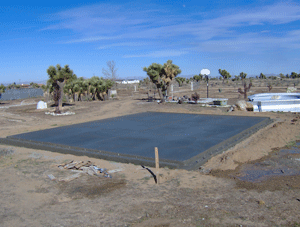
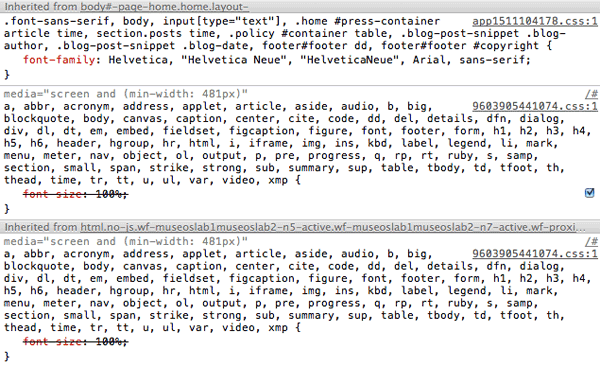
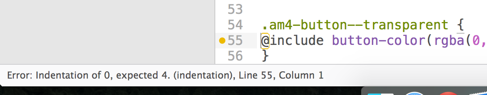
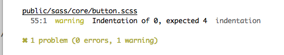

# Excellent CSS

#### Alexander Harding

---

## "CSS is easy" (?)


 * Syntactically easy: selector, property, value
   ```css
   selector [, selector2, ...] [:pseudo-class] {
     property: value;
     [property2: value2;
     ...]
    }
    ```
 * Not a programming language

---

## "CSS is hard" (?)

 * Constantly evolving -- CSS 1, 2, 2.1, 3
 * Support for a HUGE device matrix
   * FF, Safari, Chrome, IE 9/10/11/Edge on Tablets, phones, desktops (WP, iPhone, Windows 10, Mac OS X)
   ```css
   .flex {
      -ms-box-orient: horizontal;
      display: -ms-flexbox;
      display: -webkit-flex;
      display: -moz-flex;
      display: -ms-flex;
      display: flex;
   }
   ```
   <small><small>(It even broke the syntax highlighting.)</small></small>
 * Everything's a global
 * CSS specificity

---

## What you need to start with




 * normalize.css
 * `* { box-sizing: border-box }`
 * No big library <small><small>*cough* bootstrap *cough*</small></small>

---

## `normalize.css`

 * NOT a reset -- a normaliz-er
 * Preserves useful browser defaults
 * Correct bugs/inconsistencies
 * VERY simple, each rule is justified [[source]](http://nicolasgallagher.com/about-normalize-css/)
 * Always should be your base


 

---

## `box-sizing: border-box`

```css
html {
  box-sizing: border-box;
}
*, *:before, *:after {
  box-sizing: inherit;
}
```

---


---

## No big library

Touch CSS? => No Bootstrap

 * Specificity war
 * Upgrading / removal

Reasons you use bootstrap:

 * You can't CSS
 * Somebody told you to

---

## When building

 * EMs, REMs
 * BEM
 * Many files

---

## EMs, REMs
Use instead of `px`

#### EMs
Equal to the computed `font-size` of the element, inherited

#### REMs
Equal to the computed `font-size` of the `:root`


Note: except `border: 1px solid black`

---

## BEM

### Block Element Modifier

[https://css-tricks.com/bem-101/](https://css-tricks.com/bem-101/)

```css
/* Block component */
.button {}

/* Element that depends upon the block */ 
.button__price {}

/* Modifier that changes the style of the block */
.button--orange {} 
.button--big {}
```

```html
<a href="#" class="button button--orange"></a>
```

(Namespace `.am4-button` if needed)

---

## BEM cont'd

 * Block names should correspond to filenames
   ```
   .am4-button--primary {} ==> button.scss
   ```
 * Specificity is no longer a problem!
   * ONLY nest for `:hover`, `:active`, etc.
   * DO NOT nest for the sake of nesting
 * Scoping/conflicts fixed!

---

## Many files

#### Your project 

```
myProject/
  src/
    sass/
      app.scss
      _variables.scss
      _zindex.scss

      otherComponent.scss
      anotherComponent.scss

      core/
        button.scss
        form.scss
```

---

## Many files (cont'd)

#### `app.scss`

```sass
@import 'normalize';
@import 'variables';
@import 'zindex';

html {
  box-sizing: border-box;
}
*, *:before, *:after {
  box-sizing: inherit;
}

@import 'core/button';
@import 'core/form';

@import 'otherComponent';
@import 'anotherComponent';
```

(Remember to setup `includePaths`.)

---

## Bourbon

```sass
// app.scss
@import 'bourbon';
```

```sass
@include keyframes(my-animation) {
  0% {
    @include transform(translate(0, 0));
  }
  100% {
    @include transform(translate(0, -1em));
  }
}
```
=> Vendor prefixing

---

## autoprefixer

[https://github.com/postcss/autoprefixer](https://github.com/postcss/autoprefixer)

"postcss"

```js
// gulpfile.js
.pipe(postcss([ autoprefixer({ browsers: ['last 2 versions'] }) ]))
```
```css
@keyframes my-animation {
  0% {
    transform: translate(0, 0);
  }
  100% {
    transform: translate(0, -1em);
  }
}
```
=> Vendor prefixing

---

(I prefer autoprefixer.)

---

## Neat

A customizable, lightweight (use what you need), semantic grid

```sass
.am4-welcome {
  @include outer-container;
}
.am4-welcome__aside {
  @include span-columns(3);
}
.am4-welcome__content {
  @include span-columns(9);
}
```
```html
<div class="am4-welcome">
  <div class="am4-welcome__aside"></div>
  <main class="am4-welcome__content">
    <!-- Hello, world! -->
  </main>
</main>
```

Set your own breakpoints, gutter size, etc.

---

# Testing

 * Linting
 * Pixel-by-pixel

---

# Linting

Everyone ~~is~~ <sup>should be</sup> doing it.

[scss-lint](https://github.com/brigade/scss-lint) or [sass-lint](https://github.com/sasstools/sass-lint)




---

```ruby
rules:
  border-zero:
    - 1
    - convention: '0'
  brace-style:
    - 1
    - allow-single-line: true
  clean-import-paths:
    - 0
    - filename-extension: false
      leading-underscore: false
[...]
```

